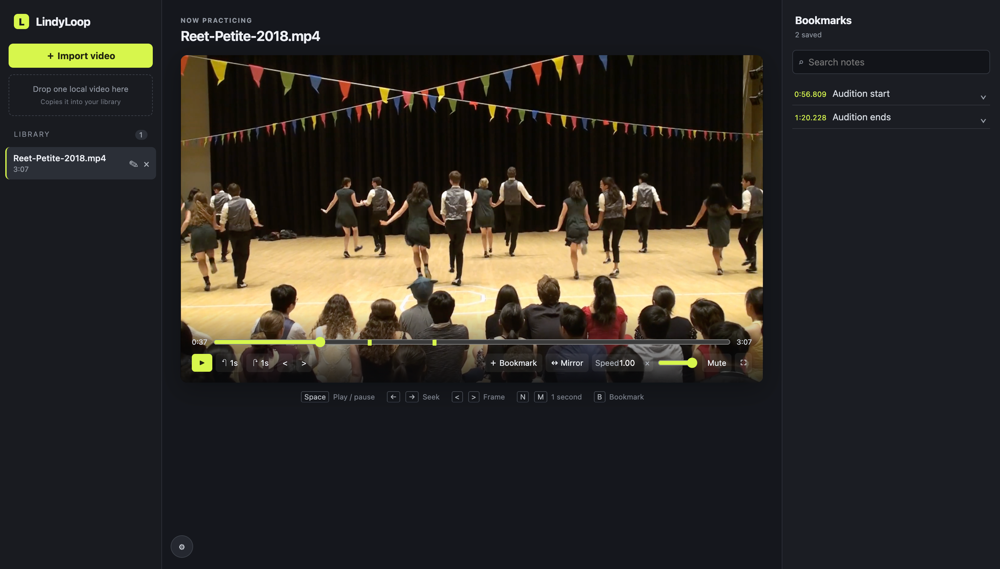

# LindyLoop

LindyLoop is a local-first dance-video practice app for macOS. It imports copies
of local video files into an app-managed library and lets one operator study,
seek, mirror, and annotate a video with timestamp bookmarks.

## Interface preview



## Requirements

- Node.js 24 LTS (see `.nvmrc`)
- Google Chrome for the browser smoke test

## Start

```sh
npm install
npm run dev
```

Open the printed `http://127.0.0.1:5173` address. The API runs on loopback and
is proxied by Vite; data defaults to
`~/Library/Application Support/LindyLoop`. For development or isolated tests,
set `LINDYLOOP_DATA_DIR` to an empty directory.

```sh
npm run typecheck
npm run lint
npm test
npm run test:e2e
npm run build
```

## Data and compatibility

Imported files are copied; their original sources are never modified. Metadata
export is not a video backup. Shut down the app and copy the entire data
directory for a complete backup. MP4 with H.264 video and AAC audio is the
first compatibility fallback when a local recording will not play in Chrome.

Read [SPEC.md](SPEC.md) for the durable product and safety requirements.
